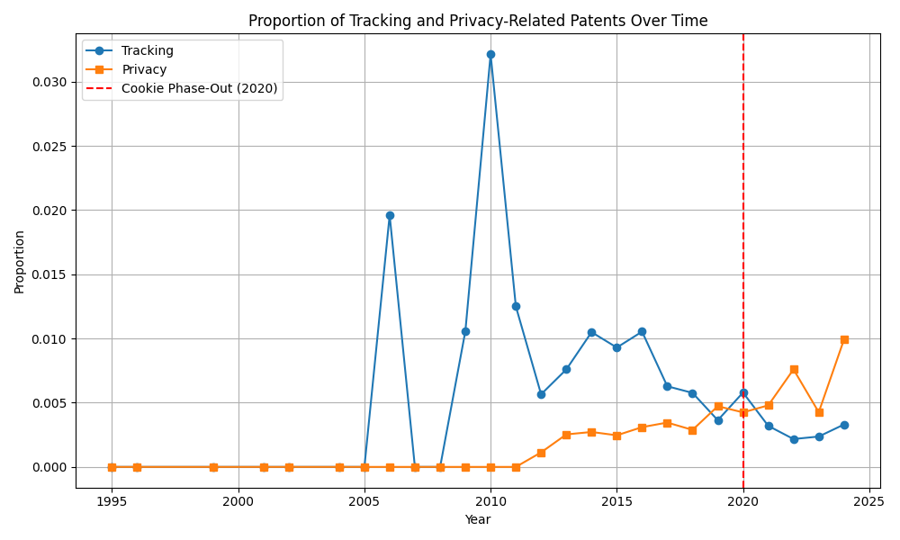

# Google Patents Analysis: Privacy vs Tracking Post-Third-Party Cookie Phase-Out

## 1. Objective and Hypotheses

This project investigates how Google’s patent strategy has evolved in response to privacy concerns, particularly following its announcement to phase out third-party cookies.

**Hypotheses:**

* **H₀ (Null Hypothesis):** The number of Google’s privacy-related patents filed after the third-party cookie phase-out announcement does not reflect ongoing development of alternative targeting systems.
* **H₁ (Alternative Hypothesis):** The number of Google’s privacy-related patents filed after the third-party cookie phase-out announcement reflects ongoing development of alternative targeting systems.

---

## 2. Dataset

* **Source:** Google Patents (filtered by assignee)
* **Scope:** 20+ years of filings
* **Size:** 38,768 patents
* **Time frame:** Up to December 2024

---

## 3. Methodology

### 3.1 Patent Topic Modeling with BERTopic

BERTopic was used to extract and visualize meaningful topics from patent abstracts. The approach includes:

* **BERT embeddings** for semantic vectorization
* **UMAP** for dimensionality reduction
* **HDBSCAN** for unsupervised clustering
* BERTopic visualization tools for topic exploration

    

### 3.2 Topic Evolution Analysis

Trends in patent filings over time were analyzed. Key findings include:

* **2014–2016:** Rise in patents on search queries, ads, geographic location, and social graphs
* **2017–2023:** Growth in topics related to image processing, speech data, wireless communication, and neural networks

    

---

## 4. Embedding Limitations and Shift to Classification

Initial analyses used cosine similarity between topic embedding centroids. However, due to semantic overlap in co-occurring terms (e.g., "privacy" and "tracking"), embeddings failed to distinguish opposing concepts.

For example, searching for “tracking” and “privacy” returned highly similar topics due to contextual overlap.

To address this, the methodology shifted toward supervised learning.

---

## 5. Machine Learning Classification

A labeled dataset was created to distinguish between privacy-related and tracking-related patents. The following models were tested:

* Logistic Regression (selected)
* SVM
* Decision Tree
* XGBoost

### 5.1 Model Performance

Logistic Regression was chosen due to its balanced and reliable performance:

* **Precision:** \~0.75
* **Recall:** \~0.75
* **F1 Score:** \~0.75

Other models showed instability, signs of overfitting or worse scores.

---

## 6. Statistical Testing

A Chi-squared test of independence was used to assess the significance of topic distribution shifts post-2020.

* **Chi-squared statistic:** 60.1
* **Degrees of freedom:** 2
* **P-value:** < 0.001

This indicates a significant and non-random change in patent filing patterns after the announcement.

---

## 7. Conclusion

The results support the **rejection of the null hypothesis (H₀)**.

There is strong evidence that Google’s increased privacy-related patent activity aligns with the development of alternative tracking and targeting systems. These results suggest a strategic adaptation that maintains or even enhances user profiling capabilities under new privacy standards.

    

